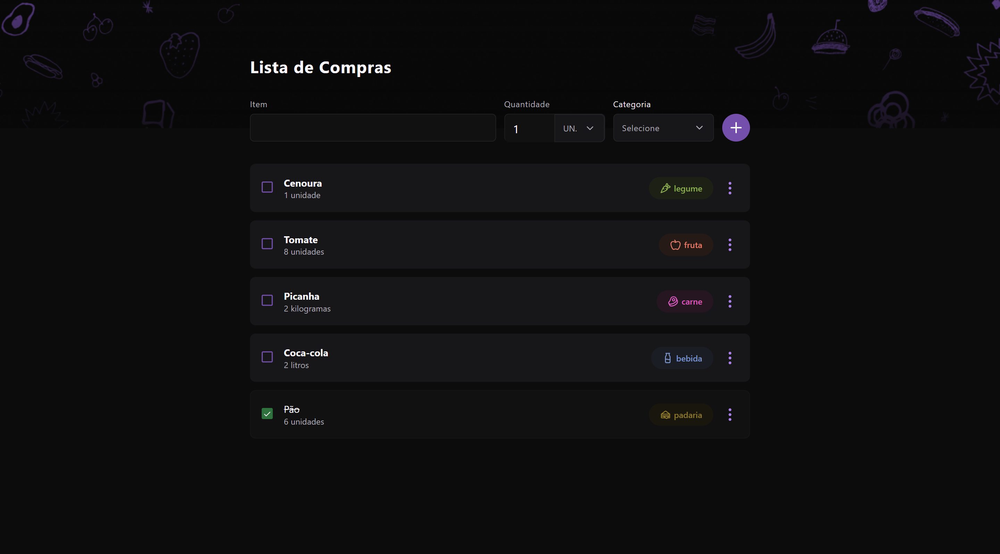

<h1 align="center"> Shopping List - BoraCodar#34 </h1>

[Clique aqui para acessar](https://shopping-list-maik.vercel.app/)

## 🚀 Tecnologias

Esse projeto foi desenvolvido com as seguintes tecnologias:

- [React](https://react.dev/)
- [Typescript](https://www.typescriptlang.org/)
- [Tailwind CSS](https://tailwindcss.com/)
- [react-select](https://react-select.com/home)
- [uuid](https://github.com/uuidjs/uuid#readme)
- Git and GitHub

## 💻 Projeto

O projeto "Shopping List" é uma aplicação que permite aos usuários criar uma lista de compras personalizada, na qual eles podem adicionar itens juntamente com suas quantidades e categorias correspondentes. Além disso, os usuários têm a opção de marcar os itens como "verificados" à medida que fazem suas compras.  

Projeto construído a partir do layout proposto no desafio [#BoraCodar34](https://boracodar.dev/) realizado pela [Rocketseat](https://rocketseat.com.br).
Após o desenvolvimento do projeto inicial, adicionei novas features, tais quais:

- Animações e efeitos hover/active;
- Funcionalidade de adicionar itens;
- Botão de exclusão de itens;
- Marcação de itens "checked";
- Mensagem para quando a lista está vazia;
- Entre outras pequenas modificações.